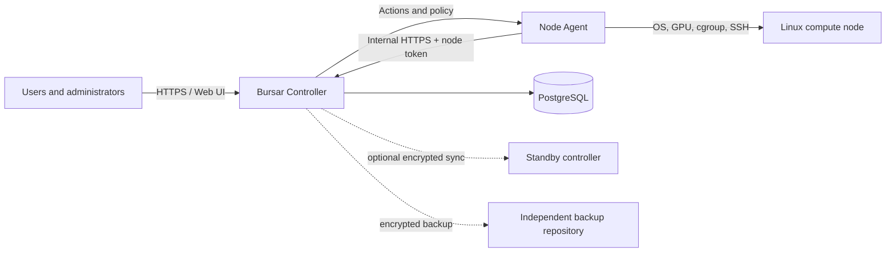

<p align="center">
  
</p>

# Bursar

*Accounts and quotas for a shared GPU cluster.*

[](https://github.com/atoz03/Bursar/actions/workflows/go-test.yml)
[](LICENSE)
[](controller/go.mod)
[](web/package.json)

**English** | [简体中文](README.zh-CN.md)

Bursar is a self-hosted operations and governance platform for shared Linux GPU servers. Users keep their normal SSH workflow while a central controller handles node visibility, usage accounting, points, quotas, account mapping, access policy, and security events.

> [!IMPORTANT]
> Bursar can execute privileged actions on compute nodes. Review the [security model](docs/security.md), start with `dry_run: true`, and complete the [go-live checklist](docs/go-live-checklist.md) before production rollout.

## Why Bursar

- **Keep SSH workflows:** no notebook gateway or custom job scheduler is required.
- **See the whole fleet:** GPU, CPU, memory, disk, processes, sessions, services, and agent health are reported centrally.
- **Account for shared resources:** GPU model and CPU-core-minute pricing, points pools, carryover, overdraft policy, and per-node overrides.
- **Enforce policies:** CPU, memory, disk, GPU visibility, exclusive use, SSH allow/deny/exemption lists, and remote process actions.
- **Manage identity:** registration review, platform-to-node account mapping, provisioning, temporary users, and delegated administrators.
- **Operate safely:** per-node agent tokens, browser sessions, CSRF protection, TOTP 2FA, optional Turnstile, audit events, encrypted backups, and optional controller HA.
- **Configure explicitly:** the first administrator is guided through platform identity, registration domains, SSH entry, prices, user policy, SMTP, and HA.

## Intended use

Bursar is designed for teams that already operate Linux GPU hosts and want governance without replacing SSH. It is not a scheduler, Kubernetes operator, hosted control plane, or substitute for network segmentation, OS hardening, monitoring, and tested backups.

## Architecture



The controller can run in single-port mode or expose a separate TLS-only internal listener for agents and HA. See [architecture](docs/architecture.md) for trust boundaries and data flow.

## Components

| Component | Purpose |
| --- | --- |
| `controller/` | Go API, policy engine, accounting, migrations, Web hosting, schedulers |
| `node-agent/` | Go agent for metrics, actions, limits, SSH state, and security signals |
| `web/` | Vue 3 and Element Plus administrator/user interface |
| `database/` | PostgreSQL schema and ordered migrations |
| `scripts/` | Build, install, deployment, backup, HA, and fleet utilities |
| `config/` | Safe controller configuration example |

## Quick start for evaluation

There are two ways to run the controller. Both build from source; the project does not publish container images.

| Path | Choose it when |
| --- | --- |
| [Docker](#option-a-docker) | You want the fastest reproducible start. One command after secrets are in place. |
| [From source](#option-b-from-source) | You want systemd supervision and the same lifecycle as the node agents. The HA and backup scripts assume this. |

The node agent always runs directly on each compute host — it needs cgroup, systemd, SSH, and GPU driver access. See [node-agent deployment](docs/node-agent.md).

### Prerequisites

- Linux or macOS host;
- Docker with Compose (both paths — the source path still uses it for PostgreSQL);
- for the source path: Go 1.26.6, Node.js 20.20 or newer, pnpm 10.28.2;
- OpenSSL and curl.

## Option A: Docker

```bash
git clone https://github.com/atoz03/Bursar.git
cd Bursar
cp .env.example .env
```

Fill in `.env` with four distinct random values — `POSTGRES_PASSWORD`, `GPUOPS_AGENT_TOKEN`, `GPUOPS_ADMIN_TOKEN`, and `GPUOPS_AUTH_SECRET`. Generate each with `openssl rand -hex 32`. Compose refuses to start if any is empty, and `.env` is ignored by Git.

```bash
docker compose --profile full up -d --build
curl -fsS http://127.0.0.1:8080/readyz
```

Migrations run automatically at startup. Continue at [Bootstrap the first administrator](#bootstrap-the-first-administrator).

## Option B: From source

### 1. Clone and configure

```bash
git clone https://github.com/atoz03/Bursar.git
cd Bursar
cp .env.example .env
cp config/controller.yaml config/controller.local.yaml
openssl rand -hex 32
openssl rand -hex 32
openssl rand -hex 32
```

Put the three different random values into `agent_token`, `admin_token`, and `auth_secret` in `config/controller.local.yaml`, and set `POSTGRES_PASSWORD` in `.env`. Placeholder values are rejected by the first-run readiness checks. Local configuration files are ignored by Git.

### 2. Start PostgreSQL

```bash
docker compose up -d postgres
docker compose ps
```

The Compose file uses development credentials from `.env` matching the example DSN. Set a strong database password and TLS policy before any non-local deployment.

### 3. Build the Web UI

```bash
corepack enable
pnpm --dir web install --frozen-lockfile
pnpm --dir web build
```

### 4. Start the controller

```bash
go run ./controller --config config/controller.local.yaml
```

In another terminal:

```bash
curl -fsS http://127.0.0.1:8080/readyz
```

A ready controller returns `{"ok":true,"database":true}`. Database migrations are applied automatically at startup.

## Bootstrap the first administrator

```bash
curl -fsS -X POST http://127.0.0.1:8080/api/admin/bootstrap \
  -H 'Content-Type: application/json' \
  -H 'Authorization: Bearer <admin_token>' \
  -d '{"username":"admin","password":"<strong-password>"}'
```

Open <http://127.0.0.1:8080/login>, sign in, and complete the Setup wizard. Public registration stays closed until all required startup checks pass and Setup is saved.

## Connect a compute node

Run the prerequisite check on the Linux node first:

```bash
bash scripts/node_prereq_check.sh
```

For a local installation from a checked-out repository:

```bash
sudo env \
  NODE_ID=node-01 \
  CONTROLLER_URL=https://controller.example.org:8081 \
  AGENT_TOKEN='<node-or-global-agent-token>' \
  bash scripts/install_agent_local.sh
```

Production deployments should use the internal TLS listener and a distinct token per node. Review [node-agent deployment](docs/node-agent.md) before enabling SSH guard or host-security changes.

## Production path

1. Read [architecture](docs/architecture.md) and [security](docs/security.md).
2. Prepare PostgreSQL, TLS, DNS, service accounts, and independent backups.
3. Follow the [installation guide](docs/installation.md) and [configuration reference](docs/configuration.md).
4. Bootstrap the administrator and complete [first-run Setup](docs/first-run-setup.md).
5. Enroll nodes using the [node-agent guide](docs/node-agent.md).
6. Start with `dry_run: true`, validate accounting, then follow the [go-live checklist](docs/go-live-checklist.md).
7. Use the [operations guide](docs/operations.md) and test [backup/HA](docs/backup-and-ha.md) before relying on failover.

## Documentation

The [documentation index](docs/README.md) includes reading paths for evaluators, operators, users, contributors, and security reviewers.

| Guide | Contents |
| --- | --- |
| [Getting started](docs/getting-started.md) | Local evaluation from zero |
| [Installation](docs/installation.md) | Production-oriented controller and node deployment |
| [Configuration](docs/configuration.md) | Every controller configuration group and secret-handling rule |
| [First-run Setup](docs/first-run-setup.md) | Administrator bootstrap and Setup workflow |
| [Architecture](docs/architecture.md) | Components, data flow, ports, and trust boundaries |
| [Node Agent](docs/node-agent.md) | Environment, installation, tokens, SSH guard, and troubleshooting |
| [Administrator guide](docs/admin-guide.md) | Roles and Web administration workflows |
| [User guide](docs/user-guide.md) | Registration, account binding, points, and SSH usage |
| [Operations](docs/operations.md) | Service lifecycle, upgrades, monitoring, and recovery |
| [Backup and HA](docs/backup-and-ha.md) | Restic backups, restore drills, synchronization, and failover |
| [Security](docs/security.md) | Threat model and hardening baseline |
| [API reference](docs/api-reference.md) | Authentication, important payloads, and endpoint catalog |
| [Go-live checklist](docs/go-live-checklist.md) | What to verify before enabling enforcement |
| [Troubleshooting](docs/troubleshooting.md) | Common controller, Web, database, and agent failures |
| [Development](docs/development.md) | Repository layout, setup, conventions, and validation |

## Development and validation

```bash
go test ./controller/... ./node-agent/...
go vet ./controller/... ./node-agent/...
pnpm --dir web install --frozen-lockfile
pnpm --dir web build
bash -n scripts/*.sh
bash scripts/check_docs.sh
```

See [CONTRIBUTING.md](CONTRIBUTING.md) for workflow and review expectations.

## Security

Report vulnerabilities privately according to [SECURITY.md](SECURITY.md). Never place tokens, keys, real host inventories, database dumps, or user data in public issues.

## About the name

A bursar is the officer who keeps each student's account: grants the allowance for the term, records what is spent, and closes the account when it runs dry. This project does that for GPU-minutes and CPU core-minutes on a cluster people share.

## License

Bursar is licensed under the [Apache License 2.0](LICENSE).
