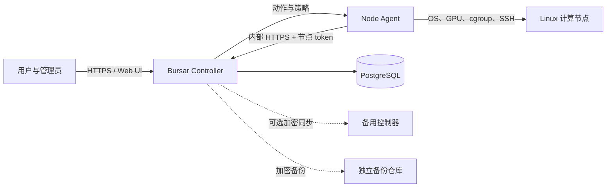

<p align="center">
  
</p>

# Bursar

*面向共享 GPU 集群的账户与配额管理。*

[](https://github.com/atoz03/gpu-ops/actions/workflows/go-test.yml)
[](LICENSE)
[](controller/go.mod)
[](web/package.json)

[English](README.md) | **简体中文**

Bursar 是一个面向共享 Linux GPU 服务器的自托管运维与治理平台。用户保留日常 SSH 使用习惯，控制器统一完成节点可观测、用量计费、积分、配额、账号映射、访问策略和安全事件管理。

> [!IMPORTANT]
> Bursar 可以在计算节点执行特权操作。生产部署前请审阅[安全模型](docs/zh-CN/security.md)，先以 `dry_run: true` 试运行，并完成[上线检查清单](docs/zh-CN/go-live-checklist.md)。

## 为什么选择 Bursar

- **保留 SSH 工作流：** 不强制引入 Notebook 网关或自定义任务调度器。
- **统一查看节点：** 集中采集 GPU、CPU、内存、磁盘、进程、会话、系统服务和 Agent 健康状态。
- **共享资源计量：** 支持 GPU 型号、CPU 核分钟价格、积分池、结转、欠费策略和节点覆盖价。
- **策略执行：** 支持 CPU、内存、磁盘、GPU 可见性、独享、SSH 名单和远程进程动作。
- **身份管理：** 支持注册审核、平台到节点账号映射、账号开通、临时用户和分级管理员。
- **安全运维：** 支持节点独立 token、Web 会话、CSRF、TOTP 2FA、可选 Turnstile、安全审计、加密备份和可选主备控制器。
- **显式配置：** 首个管理员通过 Setup 页面配置平台、注册域名、SSH 入口、价格、用户准则、SMTP 和 HA。

## 适用范围

Bursar 适合已经管理 Linux GPU 主机、希望在不替换 SSH 的情况下增加治理能力的团队。它不是任务调度器、Kubernetes Operator、托管控制面，也不能替代网络隔离、操作系统加固、监控和经过演练的备份。

## 架构



控制器支持单端口模式，也可为 Agent 和 HA 启用独立 TLS 内部端口。信任边界和数据流见[架构文档](docs/zh-CN/architecture.md)。

## 组件

| 组件 | 职责 |
| --- | --- |
| `controller/` | Go API、策略、计费、迁移、Web 托管和定时任务 |
| `node-agent/` | Go Agent，负责指标、动作、限制、SSH 状态和安全信号 |
| `web/` | Vue 3 + Element Plus 管理端与用户端 |
| `database/` | PostgreSQL Schema 和顺序迁移 |
| `scripts/` | 构建、安装、部署、备份、HA 和批量运维工具 |
| `config/` | 可公开使用的控制器配置示例 |

## 本地快速体验

控制器有两种部署方式，都从源码构建（本项目不发布容器镜像）。

| 方式 | 适用场景 |
| --- | --- |
| [Docker](#方式-a-docker) | 追求最快、可复现的启动。准备好密钥后只需一条命令。 |
| [源码构建](#方式-b-源码构建) | 需要 systemd 托管，并与 Node Agent 保持一致的生命周期。HA 与备份脚本按这种方式设计。 |

Node Agent 始终直接运行在计算节点主机上——它需要 cgroup、systemd、SSH 和 GPU 驱动访问权限，详见 [Node Agent 部署文档](docs/zh-CN/node-agent.md)。

### 环境要求

- Linux 或 macOS 主机；
- Docker Compose（两种方式都需要：源码方式也用它启动 PostgreSQL）；
- 源码方式还需要：Go 1.26.6、Node.js 20.20 或更高版本、pnpm 10.28.2；
- OpenSSL 和 curl。

## 方式 A: Docker

```bash
git clone https://github.com/atoz03/gpu-ops.git
cd gpu-ops
cp .env.example .env
```

在 `.env` 中填入四个互不相同的随机值：`POSTGRES_PASSWORD`、`GPUOPS_AGENT_TOKEN`、`GPUOPS_ADMIN_TOKEN` 和 `GPUOPS_AUTH_SECRET`，每个都用 `openssl rand -hex 32` 生成。任意一项为空时 Compose 会直接失败；`.env` 已被 Git 忽略。

```bash
docker compose --profile full up -d --build
curl -fsS http://127.0.0.1:8080/readyz
```

启动时自动执行数据库迁移。随后继续[创建首个管理员](#创建首个管理员)。

## 方式 B: 源码构建

### 1. 克隆与配置

```bash
git clone https://github.com/atoz03/gpu-ops.git
cd gpu-ops
cp .env.example .env
cp config/controller.yaml config/controller.local.yaml
openssl rand -hex 32
openssl rand -hex 32
openssl rand -hex 32
```

把三个不同的随机值分别写入 `config/controller.local.yaml` 的 `agent_token`、`admin_token` 和 `auth_secret`，并在 `.env` 中设置 `POSTGRES_PASSWORD`。Setup 就绪检查会拒绝占位值，本地配置文件已被 Git 忽略。

### 2. 启动 PostgreSQL

```bash
docker compose up -d postgres
docker compose ps
```

Compose 从 `.env` 读取与示例 DSN 一致的开发凭据。任何非本机部署都应修改数据库密码并制定 TLS 策略。

### 3. 构建 Web

```bash
corepack enable
pnpm --dir web install --frozen-lockfile
pnpm --dir web build
```

### 4. 启动控制器

```bash
go run ./controller --config config/controller.local.yaml
```

另开终端检查：

```bash
curl -fsS http://127.0.0.1:8080/readyz
```

就绪时返回 `{"ok":true,"database":true}`。控制器启动时会自动执行数据库迁移。

## 创建首个管理员

```bash
curl -fsS -X POST http://127.0.0.1:8080/api/admin/bootstrap \
  -H 'Content-Type: application/json' \
  -H 'Authorization: Bearer <admin_token>' \
  -d '{"username":"admin","password":"<strong-password>"}'
```

打开 <http://127.0.0.1:8080/login>，登录并完成 Setup。必填启动检查通过且 Setup 保存前，公开注册保持关闭。

## 接入计算节点

先在 Linux 计算节点运行只读前置检查：

```bash
bash scripts/node_prereq_check.sh
```

从已检出的仓库进行本机安装：

```bash
sudo env \
  NODE_ID=node-01 \
  CONTROLLER_URL=https://controller.example.org:8081 \
  AGENT_TOKEN='<node-or-global-agent-token>' \
  bash scripts/install_agent_local.sh
```

生产环境应使用内部 TLS 端口并为每个节点分配独立 token。启用 SSH Guard 或主机安全修改前，请先阅读 [Node Agent 部署文档](docs/zh-CN/node-agent.md)。

## 生产部署路径

1. 阅读[架构](docs/zh-CN/architecture.md)和[安全指南](docs/zh-CN/security.md)。
2. 准备 PostgreSQL、TLS、DNS、服务账号和独立备份仓库。
3. 按[安装指南](docs/zh-CN/installation.md)与[配置参考](docs/zh-CN/configuration.md)部署。
4. 创建管理员并完成[首次 Setup](docs/zh-CN/first-run-setup.md)。
5. 按 [Node Agent 指南](docs/zh-CN/node-agent.md)接入节点。
6. 先启用 `dry_run: true` 校验计费，再执行[上线检查清单](docs/zh-CN/go-live-checklist.md)。
7. 按[运维指南](docs/zh-CN/operations.md)管理服务，并在依赖容灾前演练[备份与 HA](docs/zh-CN/backup-and-ha.md)。

## 文档

[文档索引](docs/zh-CN/README.md)提供评估者、运维人员、用户、贡献者和安全审查者的阅读路径。

| 文档 | 内容 |
| --- | --- |
| [快速入门](docs/zh-CN/getting-started.md) | 从零开始的本地评估 |
| [安装指南](docs/zh-CN/installation.md) | 面向生产的控制器与节点部署 |
| [配置参考](docs/zh-CN/configuration.md) | 控制器配置和密钥规则 |
| [首次 Setup](docs/zh-CN/first-run-setup.md) | 管理员创建与首次配置 |
| [架构](docs/zh-CN/architecture.md) | 组件、数据流、端口与信任边界 |
| [Node Agent](docs/zh-CN/node-agent.md) | 环境变量、安装、token、SSH Guard 与排障 |
| [管理员指南](docs/zh-CN/admin-guide.md) | 权限和 Web 管理流程 |
| [用户指南](docs/zh-CN/user-guide.md) | 注册、绑定、积分与 SSH 使用 |
| [运维指南](docs/zh-CN/operations.md) | 服务生命周期、升级、监控和恢复 |
| [备份与 HA](docs/zh-CN/backup-and-ha.md) | Restic、恢复演练、同步和接管 |
| [安全指南](docs/zh-CN/security.md) | 威胁模型和加固基线 |
| [API 参考](docs/zh-CN/api-reference.md) | 鉴权、关键载荷和接口目录 |
| [上线检查清单](docs/zh-CN/go-live-checklist.md) | 启用强制策略前需要验证的内容 |
| [故障排查](docs/zh-CN/troubleshooting.md) | 控制器、Web、数据库和 Agent 常见故障 |
| [开发指南](docs/zh-CN/development.md) | 仓库结构、环境搭建、约定与验证 |

## 开发与验证

```bash
go test ./controller/... ./node-agent/...
go vet ./controller/... ./node-agent/...
pnpm --dir web install --frozen-lockfile
pnpm --dir web build
bash -n scripts/*.sh
bash scripts/check_docs.sh
```

贡献流程见 [CONTRIBUTING.zh-CN.md](CONTRIBUTING.zh-CN.md)。

## 安全

请按 [SECURITY.zh-CN.md](SECURITY.zh-CN.md) 私下报告漏洞。不要在公开 Issue 中粘贴 token、私钥、真实主机清单、数据库转储或用户数据。

## 关于名字

Bursar 是学校里管理学生账户的财务主管：按期发放额度、记录支出、余额耗尽时停止支用。本项目对共享集群上的 GPU 分钟与 CPU 核分钟做同样的事。

## 许可证

Bursar 使用 [Apache License 2.0](LICENSE)。
